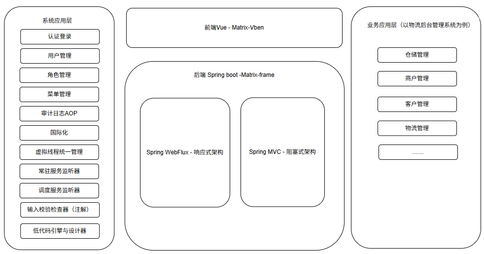

# Matrix-nebula

#### Introduction
Matrix Nebula is a series of architectural software, including three levels: monolithic architecture, assembled monolithic architecture, and assembled microservice architecture. They are implemented sequentially through iterative development. To ensure a scientific and standardized iteration process, the stages are named after the formation process of galaxies, and the term "nebula" is used as a metaphor, implying that in today's world of open/closed source software, like the stars in the universe, each one shines brightly. Matrix Nebula will also become a member of this big family. At the same time, the assembled architecture is the core of this series of architectural software. In the field of computer software, assembling the required software by simply dragging and dropping has always been a research topic. With the development of software technology, module-based construction and assembly have become easy tasks, providing strong support for solving this problem. However, the dependencies between software modules are complex, much like the concept of matrices in mathematics: defining a matrix is simple, but performing operations on multiple matrices to obtain different results is complex!

<b>In short, this is the origin of Matrix Nebula.</b>

#### The Matrix Nebula Trilogy
Rome was not built in a day, and Matrix Nebula will also go through a process from nothing to something. This process is divided into three stages from easy to difficult, named after the formation process of galaxies: Pillars of Creation, Star Shining, and Eternal Galaxy. The current project is in the Pillars of Creation stage. For more details, please visit: https://www.matx.top

#### Software Architecture

- Matrix-Nebula is a Java 21-based Spring Boot architecture project, adopting a front-end and back-end separation architecture. The front end is developed based on the Vben open-source software under the Vue3 framework; the back end uses a hybrid framework of Spring Webflux and Spring MVC.

- The Spring Webflux reactive framework has natural advantages for high-concurrency scenarios. When concurrency is high, it has obvious performance advantages over Spring MVC. However, for most software developers, reactive programming is not very friendly and requires learning related concepts.

- To balance programming friendliness and rapid development, the Spring MVC framework is also integrated. For modules with low concurrency, development can be done using Spring MVC.

- The system application layer is entirely developed based on the Spring Webflux framework; the business application layer can use either Spring Webflux or Spring MVC according to actual needs. Before development, evaluate the concurrency of the functional module. For modules with particularly high concurrency, consider using the reactive framework.

- The system application layer encapsulates a collection of out-of-the-box features. When developing applications with this framework, you only need to focus on implementing business logic.

- The biggest feature of Matrix-Nebula, in addition to supporting both reactive (Spring Webflux) and blocking (Spring MVC) frameworks, is that it also provides an extremely simple low-code module, greatly improving development efficiency. For more details, please refer to the development manual.
