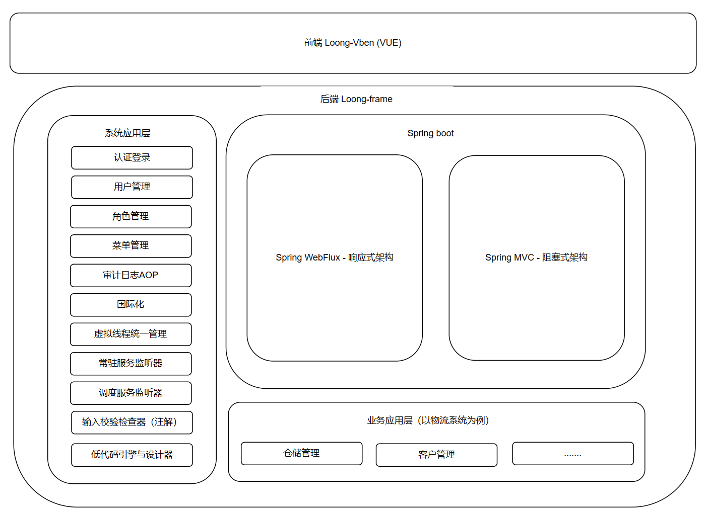

# loong-frame

#### 介绍
loong-frame(神农架构，也称龙架构)是一个面向Java21技术栈的集成式单体web应用架构，基于Spring boot3框架并融合了Spring MVC与Spring WebFlux，全面兼顾开发效率和运行效率。当前已实现了登录认证，
用户管理，角色管理，菜单管理四大基础模块并对国际化，虚拟线程，后台常驻服务，后台输入校验，操作日志审计切面进行了封装，可使您直接面向业务逻辑的开发与实现，省却基础建设的工作，特别适合中小型产品
或项目的开发工作。loong-frame使用unlicense开源协议，除了免责申明外没有任何限制，可用于商业目的，也可二次开源。
当前开源的loong-frame版本代号为rise，意为蛟龙出海，乃抛砖引玉之作。在此之后还有两个闭源版本：sphere - 龙腾四海； peak - 龙驾九天。sphere是一个使用gradle进行构建的可组装式单体应用，
特别适合于面向多产品管理成本可控的企业级中大型产品或项目；peak则是在上两个版本基础上使用spring cloud实现的微服务架构版本，适用于互联网云端应用的超大型产品或项目。
随时欢迎你的垂询，加盟，合作。联系方式：13911899175（微信号），微信联系时请写明代号：神农

#### 软件架构
loong-frame的rise版本是一个集成式单体web应用架构，在Spring boot3基础上融合了Spring MVC与Spring WebFlux框架。建议当待开发的模块运行时并发量低时可使用Spring MVC技术栈实现，开发效率高；当待开发
的模块运行时并发量高时可使用Spring WebFlux实现，运行性能优异但技术门槛高，学习路线陡峭影响开发效率。也可全部使用单一框架，任君心意。
采用前后端分离方案，前端基于vue技术栈的开源框架Vben进行的二次开发，前端工程名称：loong-vben。gitee地址：https://gitee.com/Lee7573/loong-vben

#### 安装教程

1.  生成RSA密钥：ssh-keygen -t rsa
2.  获取 RSA 公钥内容，并配置到 SSH公钥 中： cat ~/.ssh/id_rsa.pub
3.  配置本地JAVA21环境
3.  下载代码到本地：git clone git@gitee.com:Lee7573/loong-frame.git
4.  使用IDEA打开工程： cd ../loong-frame
5.  在IDEA中设置工程依赖的JAVA版本，以及Gradle的运行时JAVA版本为本地JAVA21环境
6.  在Mysql命令行执行DDL脚本，初始化数据库
7.  运行LoongApplication启动类

#### 使用说明

1.  xxxx
2.  xxxx
3.  xxxx

#### 参与贡献

1.  Fork 本仓库
2.  新建 Feat_xxx 分支
3.  提交代码
4.  新建 Pull Request

#### 特技

1.  使用 Readme\_XXX.md 来支持不同的语言，例如 Readme\_en.md, Readme\_zh.md
2.  Gitee 官方博客 [blog.gitee.com](https://blog.gitee.com)
3.  你可以 [https://gitee.com/explore](https://gitee.com/explore) 这个地址来了解 Gitee 上的优秀开源项目
4.  [GVP](https://gitee.com/gvp) 全称是 Gitee 最有价值开源项目，是综合评定出的优秀开源项目
5.  Gitee 官方提供的使用手册 [https://gitee.com/help](https://gitee.com/help)
6.  Gitee 封面人物是一档用来展示 Gitee 会员风采的栏目 [https://gitee.com/gitee-stars/](https://gitee.com/gitee-stars/)
